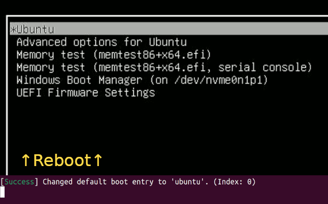

:hammer_and_wrench: GRUB default switcher
=========================================

-> [English / en](/README.md)

:fire: 概要
-----------

**デュアル/マルチブート環境においてGNU GRUBを利用している方** は、このスクリプトを実行して**再起動**するだけで、**次回起動時のOSを簡単に切り替えることができます**。

このスクリプトは、`/boot/grub/grub.cfg` に記述されているデフォルトで選択されるメニュー番号を書き換えます。


### :dart: 役に立ちそうな方

- BIOSやGRUBに簡単にアクセスできない方 (e.g., Bluetoothキーボードを利用している)

- リモートアクセス利用時に、OSを切り替えたい方




:warning: 免責事項
------------------

***このスクリプトはGRUBの設定ファイル (`/boot/grub/grub.cfg`) を直接書き換えます。***

***切り替えにおいて、GRUBが推奨している使用方法と異なる場合があります。***

***このスクリプトを使用したことによる責任は負いかねますので、十分留意してご利用ください。***


:pushpin: 仕様
--------------

|  | GRUB default switcher |
| ---: | --- |
| License | MIT |
| Language | Shell script |
| Author | k1z3 |
| GitHub Repo. | https://github.com/k1z3/grub-default-switcher |


:sparkles: 使い方
------------------

### :penguin: For Linux

0. (任意) sudoなしで実行したい場合は、`grub.cfg` をホームディレクトリに置き、シンボリックリンクを作成することをおすすめします。

    まずはコピーを作成し、バックアップを取ります。

    ```bash
    cp /boot/grub/grub.cfg ~/grub.cfg
    cp /boot/grub/grub.cfg ~/grub.cfg.bk
    ```

    次に、sudo権限で元の `grub.cfg` ファイルを削除します。

    ```bash
    sudo rm /boot/grub/grub.cfg
    ```

    最後に、コピーしたファイルのシンボリックリンクを作成します。

    ```bash
    sudo ln -s /boot/grub/grub.cfg ~/grub.cfg
    ```

1. このリポジトリをcloneします。

1. `main.sh` を実行すると、`config` ファイルが自動的に出力されます。

    ```bash
    ./main.sh
    ```

1. `config` ファイルを編集します。

    - `cfgpath`: `grub.cfg` ファイルまでの絶対パス

    - `ubuntu`, `windows` 等: GNU GRUBメニュー内の各OSが選択される行番号

        ***GNU GRUBメニューの行番号は0から始まります***

        任意の名前でも呼び出すことができます (e.g. `archlinux` とか)。

        例:
        ```plane
        cfgpath="/home/k1z3/grub.cfg"

        ubuntu=0
        windows=4
        archlinux=5
        ```

1. `main.sh` を、先ほど設定した変数名を引数として呼び出すことで、切り替えることができます。

    ```bash
    ./main.sh windows
    ```

    切り替えに成功した場合の出力:
    ```bash
    [Success] Changed default boot entry to 'windows'! (Index: 4)
    ```

1. 次回起動時(再起動時)から、Windowsが起動するようになります :tada:


### :window: For Windows

1. 事前に [上記手順 (For Linux)](#penguin-for-linux) に従って、起動に用いるGRUBが含まれているLinux環境を準備してください。

1. このスクリプトが動作するためには、[WSL](https://learn.microsoft.com/en-us/windows/wsl/install) 環境が必要です。適当なLinux環境を用意してください。

1. `grub.cfg` を書き換えるために、WSL上でLinuxをマウントします。

    コマンドプロンプトやPowershellで以下のコマンドを実行し、マウントできるディスクを探します。

    ```powershell
    GET-CimInstance -query "SELECT * from Win32_DiskDrive"
    ```

    Example:
    ```powershell
    DeviceID           Caption          Partitions Size          Model
    --------           -------          ---------- ----          -----
    \\.\PHYSICALDRIVE0 M.2 NVMe SSD 2TB          3 2000396321280 M.2 NVMe SSD 2TB
    \\.\PHYSICALDRIVE1 M.2 NVMe SSD 1TB          2 1000202273280 M.2 NVMe SSD 1TB
    ```

    今回のGRUBが含まれているLinuxは1TBなので、以下のようにマウントします。

    ```powershell
    wsl --mount \\.\PHYSICALDRIVE1 --bare
    ```

    さらに、**WSL** でパーティション番号を探します。

    ```bash
    lsblk
    ```

    Example:
    ```bash
    NAME   MAJ:MIN RM   SIZE RO TYPE MOUNTPOINTS
    sda      8:0    0 363.3M  1 disk
    sdb      8:16   0     8G  0 disk [SWAP]
    sdc      8:32   0     1T  0 disk /snap
                                    /mnt/wslg/distro
                                    /
    sdd      8:48   0 931.5G  0 disk
    ├─sdd1   8:49   0     1G  0 part
    └─sdd2   8:50   0 930.5G  0 part
    ```

    `grub.cfg` が含まれているパーティションはsdd2 (2番目) なので、**コマンドプロンプトやPowershell上** で再度マウントします。

    ```powershell
    wsl --mount \\.\PHYSICALDRIVE1 --partition 2
    ```

1. WSLに入り、このリポジトリをcloneします。

1. `main.sh` を実行すると、`config` ファイルが自動的に出力されます。

    ```bash
    ./main.sh
    ```

1. `config` ファイルを編集します。

    - `cfgpath`: `grub.cfg` ファイルまでの絶対パス

    - `ubuntu`, `windows` 等: GNU GRUBメニュー内の各OSが選択される行番号

        ***GNU GRUBメニューの行番号は0から始まります***

        任意の名前でも呼び出すことができます (e.g. `archlinux` とか)。

        Example:
        ```plane
        cfgpath="/home/k1z3/grub.cfg"

        ubuntu=0
        windows=4
        archlinux=5
        ```

1. `main.sh` を、先ほど設定した変数名を引数として呼び出すことで、切り替えることができます。

    ```bash
    ./main.sh ubuntu
    ```

    切り替えに成功した場合の出力:
    ```bash
    [Success] Changed default boot entry to 'ubuntu'! (Index: 0)
    ```

1. 次回起動時(再起動時)から、Ubuntuが起動するようになります :tada:


## 動作確認済み環境

|  | GNU GRUB |
| ---: | --- |
| 2.06 | :white_check_mark: |
